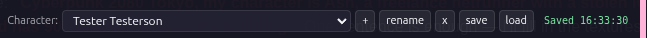

# Marinara-RPG-RP-Mode-Extension — Roleplay Mode (v0.2.0)

A Marinara Engine client extension that overlays a custom RPG ruleset
on **Roleplay Mode** chats — without forking the engine. Sister project
to [Marinara-RPG-Extension](https://github.com/Kenhito/Marinara-RPG-Extension)
which targets Game Mode.

## Quick start (5 minutes)

The fastest path: grab the self-contained release at [`releases/v0.2.0/`](releases/v0.2.0/) and follow [`releases/v0.2.0/INSTALL-GUIDE.md`](releases/v0.2.0/INSTALL-GUIDE.md). It includes:

- **The framework JS** (`RPG-Extension-RP-Mode.js`) to paste into Marinara's Extensions panel
- **Two complete reference rulesets** (D&D 5e and Exalted 3e) with bundle + agents pre-built
- **Seven AI-feedable build documents** so you can have ChatGPT, Claude.ai, or Gemini author a ruleset for any other system (GURPS, Cyberpunk RED, Vampire, Mörk Borg — anything)
- **Step-by-step install + build guides** in plain language for non-technical users

If you just want to play D&D or Exalted in Roleplay Mode, three pastes and you're done.

If you want a system the framework doesn't ship, see [`releases/v0.2.0/BUILD-YOUR-OWN-RULESET.md`](releases/v0.2.0/BUILD-YOUR-OWN-RULESET.md) — three options for AI-assisted or manual authoring.

## What's new in v0.2.0

- **Typed damage** on health-style tracks (Bashing/Lethal/Aggravated for Storyteller systems, slashing/piercing/bludgeoning for D&D, etc.). Per-type colors, severity-stacking display, per-type "Take" + "heal worst" buttons. State-mutator routes `field="bashing" delta="+3"` automatically.
- **Sorcery / multi-turn casting category** in the spellbook. Spells filed under `"sorcery"` get auto-tagged in their lorebook entries; the state-mutator override walks declare → accumulate sorcerous motes → unleash with Willpower refund.
- **Agents decoupled from bundle.** New `tools/build-agents.mjs` produces `agents.json` separately. Users import via Marinara's Import Agents dialog. Prompt updates ship without forcing users to reinstall the ruleset.
- **CSP-safe formula evaluator.** The `{StatName}*N+M` parser uses recursive descent instead of `new Function`. Marinara pages with strict CSP now compute bar maxes correctly (Personal Motes on an Essence-7 Exalt now shows /31 instead of /10).
- **State-mutator field-name normalization** + max-clamp on numeric deltas + persisted dedupe across reloads.
- **Lorebook install path rewritten** to fix the silent-failure bulk endpoint.
- **Self-contained release folder** at `releases/v0.2.0/`.

See [`CHANGELOG.md`](CHANGELOG.md) for the full list.

## Agent layout (canonical pool + RP-mode toggle policy)

The canonical agent pool shared with the [GM-mode extension](https://github.com/Kenhito/Marinara-RPG-Extension):

- **Universal sub-agents (shared baselines in `agents/`):** `combat-overseer` (pre_generation — combat math + NPC roster in one prompt), `context-fuser` (pre_generation — rules-query answers + player-state reminder in one prompt), `state-mutator` (post_processing — parses GM output for `[mrr-state: ...]` tags and writes to the sheet).
- **Optional pre-input-transformer:** auto-derived from `ruleset.vocabularyHints[]` when present. Translates D&D-flavored player input into ruleset vocabulary.
- **Per-system parallel-phase overlays:** live only at `rulesets/<id>/agents/<role>.md`. Examples: `anima-banner-monitor` + `charm-cooldown-tracker` for `exalted3e`; `blood-pool-tracker` for `vtmv20`. These run alongside the narrator without blocking it; cannot be merged into universal baselines because the resources they track are unique to that system.
- **Main GM agent (`gm-agent.md`):** per-system narrator brain. Teaches the model your dice mechanic, skill list, derived stats, dice-tag format.

**RP-mode install posture:** sub-agents install via Marinara's Import Agents dialog with `enabled:false` by default. RP-mode HAS per-agent toggle UI in Settings → Agents, so users opt into the sub-agents they want. This is a deliberate departure from GM-mode (which ships `enabled:true` because GM-mode lacks the toggle UI — see GM repo for that policy). Both modes share the same canonical agent pool; only the enablement default differs.

**Migration from v0.4.x legacy installs (matched against the GM-mode change):** if you had the older `combat-adjudicator` / `npc-bookkeeper` / `lore-query` / `state-reminder` set installed in RP-mode, they're no longer shipped from the build pipeline. Use Marinara's Import Agents dialog with the current bundle to refresh; remove orphaned legacy sub-agents through Marinara's stock agent UI.

## Why a separate project for Roleplay Mode?

Marinara Engine has four chat modes: `conversation`, `roleplay`,
`visual_novel`, and `game`. The two we care about for tabletop-style
RPG play are `game` (with hardcoded combat encounter modal, d20 skill
checks, reputation tags) and `roleplay` (without those engine-imposed
mechanics).

The Game-Mode extension works around the engine's hardcoded systems —
the 50-character reputation `action` cap, the d20-tag prompt format,
the encounter modal that always uses d20 + DC mechanics. The
Roleplay-Mode extension doesn't need any of those workarounds. RP mode
gives the overlay full control over dice math (via the in-extension
dice widget), unrestricted lorebook prose (no per-action character
caps), and a clean multi-agent surface for future state-tracker and
lore-lookup agents that don't fit the GM-mode single-narrator pattern.

## Capability matrix

| Feature                              | Game-Mode ext | RP-Mode ext (this) |
|--------------------------------------|:-------------:|:-------------------:|
| Custom dice math (configured systems)| ✓ (in widget) | ✓ (in widget)       |
| Custom skill / attribute taxonomy    | ✓             | ✓                   |
| Tier-based skill proficiency         | ✓ (v0.4)      | ✓ (ported)          |
| Named skill specialties              | ✓ (v0.4)      | ✓ (ported)          |
| Equipment / inventory + bonuses      | ✓             | ✓                   |
| Lorebook auto-install (bundle)       | ✓             | ✓                   |
| Single-paste install via `bundle.json` | ✓           | ✓                   |
| Engine `world-state` cooperation     | n/a           | ✓ (default agent)   |
| Engine `prose-guardian` cooperation  | n/a           | ✓ (default agent)   |
| Engine `continuity` cooperation      | n/a           | ✓ (default agent)   |
| Multi-agent overlay (tracker, lore)  | hard          | ✓ (opt-in, off by default) |

## What ships in v0.0.1

- **Framework:** `extension/RPG-Extension-RP-Mode.js` (single-paste client
  extension; CSS embedded inline) plus `extension/RPG-Extension-RP-Mode.css`
  (companion stylesheet for direct edits).
- **Schema:** `schema/bundle.schema.json` — install bundle envelope
  with discriminator `"schema": "mrrp-bundle"`.
- **Tools:** `tools/build-bundle.mjs`, `tools/validate-bundle.mjs`,
  `tools/validate-ruleset.mjs`, `tools/embed-css.mjs`.
- **Reference rulesets:**
  - `rulesets/dnd5e/` — Dungeons & Dragons 5th Edition (SRD 5.1).
  - `rulesets/exalted3e/` — Exalted 3rd Edition.

### Optional sub-agents (off by default)

Each ruleset bundle installs five **optional** pre-generation sub-agents
alongside the main `gmAgent`. They install **disabled by default**;
flip individual ones on in **Marinara → Settings → Agents** to opt
into specific behaviors. Each sub-agent adds one model call per turn
while enabled, so enable only what your campaign needs.

**Pick ONE pre-gen path — canonical (recommended) or legacy. Don't enable both at once or you get double-coverage.** Per-system parallel-phase overlays work alongside either path.

### Canonical path (recommended, post-2026-05-22)

| Sub-agent | What it does | Enable when… |
|---|---|---|
| `combat-overseer` | Combat-math framing AND NPC roster in one prompt. Wakes when combat is active or NPCs are in scene; outputs `"No combat active."` / `"No NPCs to track."` for whichever section is idle. | You want combat math + NPC state without paying for two separate AI calls per turn. |
| `context-fuser` | Rules-query answers AND player-state reminder in one prompt. Section 1 wakes on rules questions; Section 2 fires when there's meaningful tracked state. | You want both rules support and sheet-state continuity in a single agent. |
| `state-mutator` | Tells the narration model to emit hidden `[mrr-state: …]` tags when narrative changes the sheet (HP, conditions, inventory). Extension parses tags, applies the change, shows a toast. | You want narration to drive the sheet automatically. Stays enabled on either path. |

### Legacy path (v0.4.x compatibility, kept for per-responsibility focus)

| Sub-agent | What it does | Enable when… |
|---|---|---|
| `state-mutator` | (same as canonical — shared between paths) | (same) |
| `state-reminder` | Surfaces a short bulleted list of current PC state (HP, conditions, gear, resources) at the top of every turn. | Long sessions or complex sheets, the model is forgetting your stats. |
| `combat-adjudicator` | Wakes only in combat; restates initiative, action economy, attack/damage formulas, conditions in the active ruleset's terms. Outputs `"No combat active."` and stops in social/ambient scenes. | You run heavy-mechanics combat encounters. |
| `lore-query` | Wakes only when the latest user message is a rules question. Answers from the installed lorebook + system RAW. Outputs `"No rules query."` otherwise. | You frequently ask the model rules questions mid-RP. |
| `npc-bookkeeper` | Tracks active and recently-engaged NPC HP, conditions, tactical state, and telegraphed intentions across turns. Outputs `"No NPCs to track."` when no NPCs are in scene. | Combat/social scenes with multiple named NPCs you want continuity on. |

### Per-system parallel-phase overlays (universal across paths)

| Sub-agent | Ruleset | What it does |
|---|---|---|
| `anima-banner-monitor` | `exalted3e` | Tracks each Solar/Lunar/Sidereal/Dragon-Blooded character's anima banner level based on Peripheral mote spend across the scene. Runs in parallel — no added per-turn latency. |
| `charm-cooldown-tracker` | `exalted3e` | Scans recent turns for Charm activations; emits a per-scene cooldown summary. Runs in parallel. |
| `blood-pool-tracker` | `vtmv20` | Tracks each Kindred's current Blood Pool, per-turn generation cap, recent significant changes. Runs in parallel. |

The same descriptions are also in each system's installed lorebook
(under "Optional Sub-Agents") so they surface in-engine when you ask
the chat about them.

To enable: open the gear icon in Marinara, go to **Settings → Agents**,
find the agent (named `MRRP: <System> — <Role>`), toggle on. The agent
persists across chats; toggle off any time.

### Compatibility with Marinara's built-in agents

If you want to also turn on some of Marinara's 25+ built-in agents
(`director`, `quest`, `cyoa`, `chat-summary`, `illustrator`, etc.) in
the same chat, see [`docs/AGENT-COMPATIBILITY.md`](docs/AGENT-COMPATIBILITY.md)
for the full matrix. Short version:

- **Don't enable** `combat`, `knowledge-retrieval`, `knowledge-router`,
  `character-tracker`, or `persona-stats` — each one directly conflicts
  with one of our five sub-agents.
- **Caution** on `editor` (may strip our `[mrrp-state:]` tags) and
  `lorebook-keeper` (may pollute our managed ruleset lorebook).
- Everything else is safe to enable freely; the matrix lists "Enable
  when…" guidance per agent.

---

Both rulesets ship with `bundle.json` (the install file) plus their
source files (`ruleset.json`, `gm-agent.md`, `lorebook.json`). Vibecoder
authors can skip the source files entirely and ship a `bundle.json`
alone; see `AUTHORING-PROMPT.md`.

## Install

The install path is identical to the Game-Mode extension's path. Two
imports, end to end:

1. **Import the framework JS file.** Open Marinara at
   `http://localhost:7860`. Settings → Extensions → Add Extension →
   import `extension/RPG-Extension-RP-Mode.js` (Marinara's Extensions UI is
   file-import, not text-paste). CSS is embedded inline in the JS, so
   you only import the one file. Save and enable.

2. **Import a ruleset bundle.** A new "Ruleset" button appears in the
   chat header. Click it, then either import the `bundle.json` file
   directly (file-import button in the dialog) or paste its contents
   into the textarea. Click Install. Use either
   `rulesets/dnd5e/bundle.json` or `rulesets/exalted3e/bundle.json`.

   

3. **Import the agents file (optional but recommended).** As of v0.2.0
   the optional sub-agents ship as a separate `agents.json` file rather
   than inside the bundle, so prompt updates can roll out without
   forcing a full ruleset reinstall. In the same Ruleset dialog click
   **Import agents**, then either choose the `agents.json` file or
   paste its contents into the textarea, and click **Apply (replace
   agents)**. Existing agents tagged with the same `rulesetId` are
   deleted and replaced — no duplicate accumulation.

   

The installer creates / updates one custom agent and one lorebook in
your Marinara database. Re-installing the same bundle is idempotent —
matched by `mrrpManaged: true` settings flag and lorebook tags.

### Cross-OS file paths

| Platform | Marinara data path |
|---|---|
| Linux   | `~/Marinara-Engine/packages/server/data/` |
| macOS   | `~/Library/Application Support/Marinara-Engine/data/` |
| Windows | `%APPDATA%\Marinara-Engine\data` |

The extension itself is platform-agnostic — these paths only matter if
you want to back up the database before testing.

## Coexistence with the Game-Mode extension

Each mode uses a different mode identifier - mrr- for GM mode and mrrp- for RP mode - to differentiate which toolset it is designed to work with. That said, the UI may overlap if both modes are installed. For best results only install one mode at a time.

## Character data persistence



Character sheets are stored in your **browser's localStorage**, keyed to the chat ID + character ID. The bar at the top of every sheet (shown above) is how you manage characters and their saves. From left to right:

| Control | What it does |
|---------|--------------|
| **Character dropdown** | Switch between characters in the current chat |
| **+** | Create a new character in this chat |
| **rename** | Rename the active character |
| **x** | Remove the active character from this chat (irreversible — there's no trash) |
| **save** | **Download** all characters in the active chat as a JSON file you keep on your computer |
| **load** | **Replace** all characters in the active chat with a previously-downloaded JSON file |
| **Saved HH:MM:SS** | Timestamp of the most recent in-browser auto-save (every edit auto-saves to localStorage). **This is NOT a permanent save.** |

### ⚠️ localStorage is volatile — save your characters regularly

The auto-save indicator confirms your sheet is currently persisted in your browser's local storage, **but localStorage is NOT a long-term backup.** Your characters can disappear if any of the following happens:

- You **clear site data** for the Marinara host (browser settings → privacy → clear data)
- You **switch browsers** (Firefox character won't appear in Chrome, and vice versa)
- You **switch devices or computers** (localStorage doesn't sync)
- Your browser **hits its per-site storage quota** and evicts older entries
- You uninstall and reinstall the extension on a fresh profile
- Private / incognito browser sessions wipe their localStorage on close
- A browser update bug, OS reinstall, or disk failure wipes the profile

**To permanently save a character: hit the `save` button.** It downloads a JSON file containing every character in the current chat. Store these files in a folder you control — sync them to cloud storage, commit them to git, email them to yourself, whatever fits your workflow. Save after every meaningful session (XP gain, gear changes, story moments, end of session).

**To restore characters into a new chat: hit `load`** and pick the JSON file. The current chat's characters are replaced with the file's contents (every character in the saved file). Chat IDs rotate per Marinara session, so a fresh chat will look like a blank slate until you `load` your saved file. You can also `load` the same file into multiple chats — the characters will appear in each chat independently.

**Bottom line**: think of localStorage as "draft, in flight." The downloaded JSON is the master copy.

## Engine constraints — what this overlay still cannot do

- **It cannot change the engine's roleplay-mode default agents.**
  `world-state`, `prose-guardian`, `continuity`, and `expression`
  remain part of the default pipeline. The overlay agent runs alongside
  them as a `pre_generation` context-injection. Authors should write
  agent prompts that cooperate with — not replace — those defaults.
- **It cannot bind a custom dice widget into the engine's chat UI
  beyond what the floating widget provides.** The widget is positioned
  via CSS `position: fixed` and persists across chats; it is not
  embedded in the engine's message composer.
- **It cannot rewrite messages after the engine has streamed them.**
  All overlay influence happens via context injection before generation.

## Repo layout

```
extension/
  RPG-Extension-RP-Mode.js      # Single-paste client extension. CSS embedded.
  RPG-Extension-RP-Mode.css     # Source CSS — edit, then `npm run embed-css`.
schema/
  bundle.schema.json     # Install bundle envelope schema (discriminator: mrrp-bundle).
  ruleset.schema.json    # Ruleset-data schema (shared semantics with GM-mode ext).
tools/
  build-bundle.mjs       # ruleset.json + gm-agent.md + lorebook.json -> bundle.json
  validate-bundle.mjs    # Schema-validates bundle.json files.
  validate-ruleset.mjs   # Schema-validates ruleset.json files.
  build-character-card.mjs # V2 character card builder.
  embed-css.mjs          # Embed RPG-Extension-RP-Mode.css into RPG-Extension-RP-Mode.js.
rulesets/                # Reference systems — same four as the GM-mode sibling.
  dnd5e/                 # D&D 5e (SRD 5.1).
  exalted3e/             # Exalted 3rd Edition (paraphrased mechanics).
  fate-core/             # Fate Core (4dF + ladder).
  pathfinder2e/          # Pathfinder 2nd Edition (Remaster) — bundle-only.
agents/                  # Sub-agent prompt sources. Two pre-gen paths coexist; pick one.
  combat-overseer.md     # Canonical: combat math + NPC roster in one prompt.
  context-fuser.md       # Canonical: rules-query answers + player-state in one prompt.
  state-mutator.md       # Both paths: emits [mrrp-state: ...] tags from narration.
  state-reminder.md      # Legacy: surfaces current PC state each turn.
  combat-adjudicator.md  # Legacy: combat-only; restates initiative + math.
  lore-query.md          # Legacy: rules-question-only; cites lorebook + RAW.
  npc-bookkeeper.md      # Legacy: tracks NPC HP / conditions / intent across turns.
  # Per-system parallel-phase overlays live at rulesets/<id>/agents/<role>.md
  # (anima-banner-monitor, charm-cooldown-tracker, blood-pool-tracker, etc).
docs/                    # Authoring + install + engine-constraints reference.
  ADDING-RULESETS.md
  AUTHORING.md
  ENGINE-CONSTRAINTS.md  # RP-mode-specific (the GM-mode sibling has its own).
  INSTALL.md
  LOREBOOK-KEEPER-SCOPING.md
AGENTS.md                # AI-agent reference for THIS repo.
AUTHORING-PROMPT.md      # Paste-ready prompt for vibecoder authors.
CHANGELOG.md             # Keep-a-Changelog.
```

## Authoring your own ruleset

### The fast path — vibe-code with a chat AI

Open **`AUTHORING-PROMPT.md`**, copy it whole into a chat with a frontier model (Claude, GPT-5, Gemini Pro), and paste it as your system prompt. The prompt directs the AI to read this repo's authoritative source files, then produce a single `bundle.json` for your system. The AI knows what files it needs to consume:

| File | What the AI reads it for |
|---|---|
| `schema/bundle.schema.json` | The exact JSON shape required (discriminator `mrrp-bundle`, integer `position`, required fields). |
| `schema/ruleset.schema.json` | Attribute, skill, derived-stat, and resolution-mode constraints. |
| `docs/ADDING-RULESETS.md` | Full walkthrough including the RP-mode framing rules. |
| `docs/AUTHORING.md` | Bundle anatomy, eight-step authoring process, common pitfalls. |
| `docs/ENGINE-CONSTRAINTS.md` | What roleplay-mode bundles can and cannot change — different from the GM-mode sibling. |
| `agents/*.md` | The five optional sub-agent prompt sources. |
| One reference bundle (`rulesets/dnd5e/bundle.json` for d20, `exalted3e` for dice pool, `fate-core` for fate ladder, `pathfinder2e` for d20 with three-action economy) | Concrete example of every field populated correctly. |

Hard requirements your AI's output MUST hit:

- **RP-mode framing in `gmAgent.promptTemplate`.** Open with cooperative wording: "You provide rules guidance for ⟨system⟩ in Marinara Engine's roleplay mode, working alongside the engine's default world-state, prose-guardian, continuity, and expression agents." NOT "You are the GM." NOT "running inside Marinara Engine's Game Mode."
- **No `[d20: …]` engine-tag instructions** unless the system uses d20 mechanics — and even then, prefer the in-extension dice widget. Instruct the model to call out the check ("that's a Stealth check at DC 17"), then let the player resolve via the widget.
- **`gmAgent.promptTemplate` ≥ 50 characters** (schema minimum). Realistically aim for 800+ words covering: system identity, dice mechanic, cooperation framing, what to emit each turn.
- **Integer `position` 0 | 1 | 2** on every lorebook entry (not strings).
- **`schema: "mrrp-bundle"`** discriminator literal — NOT `"mrr-bundle"` (that's the GM-mode sibling).
- **Sub-agents install disabled by default.** If your bundle ships sub-agents in `additionalAgents[]` you genuinely want enabled on install, set `"enabled": true` on that item explicitly. Otherwise the user toggles them on per-agent in Settings → Agents.
- **Character cards (if shipped):** V2 spec (`spec: "chara_card_v2"`, `spec_version: "2.0"`).

Run `node tools/validate-bundle.mjs rulesets/your-system/bundle.json` after the AI hands back the result. The validator emits `path/expected/got/hint` records — paste any errors back to the AI for a corrected bundle.

### The developer path — assemble from sources

> **For the generator-pipeline reference** (every `tools/*.mjs` script, what each consumes, what each emits, and which `ruleset.json` fields drive each one), see **[`docs/BUILDING.md`](docs/BUILDING.md)**. It's the canonical contract for the spec-driven build pipeline; pair it with `schema/ruleset.schema.json` and you can scaffold a complete bundle from spec alone, no codebase spelunking required.

1. Copy the closest existing bundle directory (`rulesets/dnd5e/`, `exalted3e/`, `fate-core/`, or `pathfinder2e/`) to `rulesets/your-system/`.
2. Edit `ruleset.json` — your dice, attributes, skills, difficulty ladder, dice-tag format.
3. Run `node tools/validate-ruleset.mjs rulesets/your-system/ruleset.json` to confirm.
4. Edit `gm-agent.md` to teach the GM your mechanics and dice-tag format — apply the RP-mode framing rules above.
5. Build `lorebook.json` for your system's rules reference.
6. (Optional) Edit `agents/<role>.md` for sub-agents — see existing files in this repo's `agents/`.
7. Write `INSTALL.md` for end users.
8. Run `node tools/build-bundle.mjs rulesets/your-system/` to assemble the inputs into `bundle.json`.
9. Run `node tools/validate-bundle.mjs rulesets/your-system/bundle.json` to confirm shape.
10. Test in a real chat with a real model before declaring done.

### Resolution modes available today

The schema supports **nine resolution modes** covering the dominant tabletop families. Each entry below lists the schema mode name + a sample of the tabletop systems it fits.

- **d20 + modifier vs DC** (`single-roll`) — D&D 5e, Pathfinder 1e / 2e, Cypher System, D&D 3.x and OGL retroclones. Single d20 roll + modifier compared against a difficulty class.
- **Storyteller / d10 dice pool** (`dice-pool`) — Vampire: The Masquerade V20, Werewolf: The Apocalypse W20, Mage: The Ascension M20, Exalted (all editions), oWoD / nWoD / Chronicles of Darkness, Shadowrun. Roll Xd10, count successes against a target face (variable per-roll in V20/W20/M20; fixed 7 in Exalted 3e); doubled max-face; botches on 1s when zero successes.
- **Percentile under skill** (`d100-percentile`) — Call of Cthulhu (1e-6e), BRP, RuneQuest, Stormbringer, Mythras. 1d100 ≤ skill rating; lower is better.
- **PbtA 2d6 with bands** (`2d6-stat`) — Apocalypse World, Dungeon World, Monster of the Week, Masks, Blades-adjacent PbtA hacks. 2d6 + stat with 10+ / 7-9 / 6- outcome bands.
- **Fate ladder** (`fate-ladder`) — Fate Core, Fate Accelerated, Fate-of-Cthulhu, Fudge. 4dF (Fudge dice) + skill against a verbal ladder; Success-with-Style at +3 margin.
- **Roll-under sum** (`roll-under`) — GURPS (3d6), Call of Cthulhu 7e (1d100), Pendragon. Dice total ≤ target = success; higher target = better. Optional critical-success and fumble thresholds.
- **Stance-modal dice pool** (`stance-modal-pool`) — Lasers & Feelings, Stewpot, Trophy Dark. Xd6 pool with a per-roll stance toggle (one stat counts under, the other over); a designated "bridge" face value (e.g. LASER FEELINGS in L&F) grants both success AND triggers a player question.
- **OpenD6 / dice-pool sum** (`dice-pool-sum`) — OpenD6, WEG Star Wars d6 (1987-1999), Mini Six. Roll Xd6, sum, compare against difficulty. Supports the **Wild Die** mechanic (one die in the pool explodes on max face cascading, and flags a complication on 1). Supports **pip granularity** (1/3-of-a-die precision for OpenD6's NDX+P notation).
- **Narrative-handled** (`narrative-handled`) — Trophy Dark dark dice, prose-resolved scenes, GM-overrules resolution. No mechanical roll — the GM/narration adjudicates outcomes based on fiction.

**Don't see your favorite system's mechanic above?** Ask Kenhito in the **Marinara Extension community thread** (or open a GitHub issue at this repo) and describe the core resolution rule, the shape of one full roll, and any special mechanics (exploding dice, opposed rolls, multi-stat pulls). Schema additions take a few days when scoped right. Don't try to encode an unsupported mechanic under the closest existing mode — that produces a sheet/widget that lies to the player.

Full per-mode `resolution` block shapes are documented in `docs/AUTHORING-PHASE-6.md` section 1.

## License

MIT. See `LICENSE`.

## Contributing

Issues and PRs welcome once the public repo lands. For now this is a
single-maintainer scaffold; please reach out before sending changes.
